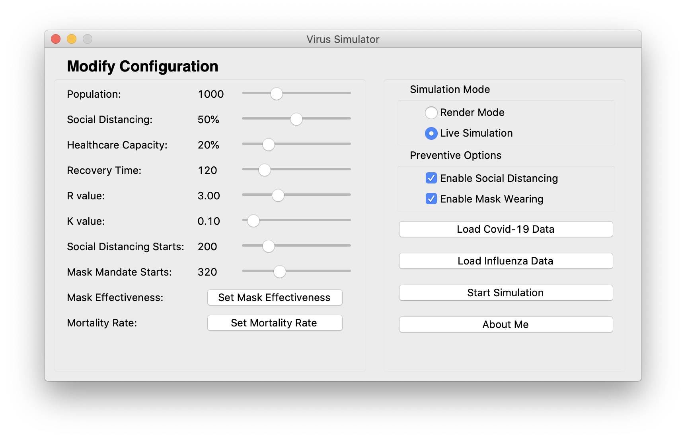

# Viral Diseases Simulator


This is a virus simulation system built as the semester project of INFO6205 for fall 2020.

#
<p align="center">

<br>

<br>

</p>

### Example Renders

Some example renders can be found in *render/Examples* or from the following links:

- [Covid with uncontrolled spread.](https://thumbs.gfycat.com/GlassFluidGoldfinch-mobile.mp4)

- [Covid with some social distancing and mask mandates](https://thumbs.gfycat.com/MintyDependentGangesdolphin-mobile.mp4)

- [Imaginary virus with R = 8.21 and K = 0.9 and uncontrolled spread.](https://thumbs.gfycat.com/CompetentReadyAntarcticgiantpetrel-mobile.mp4)

- [Imaginary virus with R = 8.21 and K = 0.9 and some social distancing and mask mandates](https://thumbs.gfycat.com/FlawedWarlikeKitten-mobile.mp4)

#

## Using pre-built binaries
### macOS
[Download](https://github.com/mnk400/virussim/releases/) packaged application for macOS. If the application does not open on double click, open by right clicking the application and then clicking open. This is required because this is not a signed binary.

### Windows
[Download](https://github.com/mnk400/virussim/releases/) for the portable windows version. Run by finding and double clicking "Viral Disease Simulator.exe" in the directory. If windows shows a warning, please click on "More Info" and then "Run Anyways".

### Linux
[Download](https://github.com/mnk400/virussim/releases/) for the portable binary for linux. Run by naviagting to the downloaded directory in commandline, and running `./"Viral Disease Simulator"`.

## Running from codebase
Note: For macOS, you need a python version with tkinter version 6.8 or greater, or use the --disable-UI flag to disable UI completely. I recommend python3.8 or above from the [python.org](https://www.python.org/downloads/release/python-386/), please note python versions from brew WILL not work. 
```
pip install -r requirements.txt --user
python main.py
```
### To run with no GUI
To disable the helper GUI, use --disable-UI flag.
```
python main.py --disable-UI
```
This will load all the data from *config/config.ini*.  This will default to *covid.stats* portion of the config when it comes to variables that define the characteristics of a virus(stuff like K or R value). Change the values in the *covid.stats* to change virus characteristics.

## References
Created by [Manik](https://github.com/mnk400), [Pallak Singh](https://github.com/pally2409), and [Yatish Pitta](https://github.com/yatish1231)
